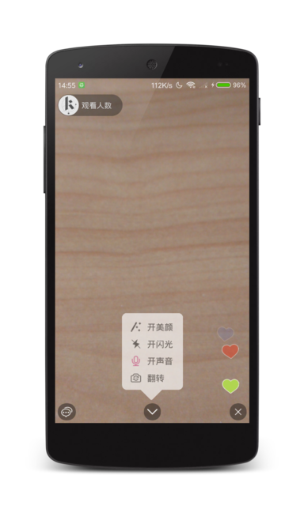

## Live APP ##
<div align="center">
	
</div>

## APP APK ##
[](https://www.pgyer.com/nIfz)

## APP PICS ##
|登录|直播列表|个人信息|创建直播|
|:-:|:-:|:-:|:-:|
|||||

|主播界面|观众界面|发送礼物|全屏礼物|
|:-:|:-:|:-:|:-:|
|||||

## Highlights ##
* Kotlin开发。
* 腾讯云互动直播SDK。
* 腾讯云云通信IM SDK。
* LeanCloud云后台。
* 七牛云储存图片。

## License ##
``````
Copyright 2017 tzizi5566

Licensed under the Apache License, Version 2.0 (the "License");
you may not use this file except in compliance with the License.
You may obtain a copy of the License at

   http://www.apache.org/licenses/LICENSE-2.0

Unless required by applicable law or agreed to in writing, software
distributed under the License is distributed on an "AS IS" BASIS,
WITHOUT WARRANTIES OR CONDITIONS OF ANY KIND, either express or implied.
See the License for the specific language governing permissions and
limitations under the License.
``````
